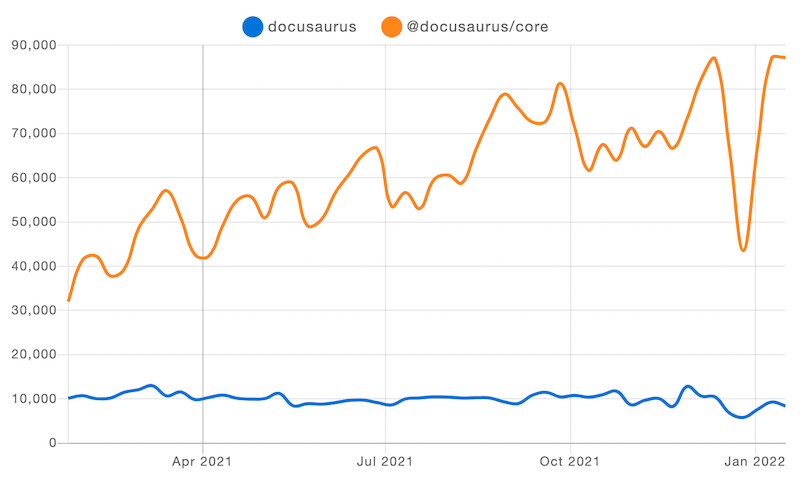

Docusaurus 在2021年取得了重大進展！我們見證了大量關注度，並剛剛突破**GitHub 30k星標**！

我們已實現與v1版本的**完整功能對等**，包括[國際化功能發佈](/blog/2021/03-09-releasing-docusaurus-i18n.mdx)、[宣佈**首個測試版**](/blog/2021/05-12-announcing-docusaurus-two-beta/index.mdx)，並在今年迎來**顯著增長的用戶群**。

**官方v2正式版**即將發佈！請關注[路線圖議題](https://github.com/facebook/docusaurus/issues/6113)獲取最新動態。

<!--truncate-->

## 年度亮點

讓我們先回顧今年的重要進展。還記得半年前[待辦清單](/blog/2021/05-12-announcing-docusaurus-two-beta/index.mdx#whats-next)嗎？現在正是檢視成果的時刻！

- **國際化**：自2020年末初步落地後，歷經四個月正式發佈，現已被[眾多專案](/showcase?tags=i18n)成功採用
- **自動生成側邊欄**：無需再維護龐大的`sidebars.js`文件
- **Webpack 5**：顯著提升構建效能
- **尾部斜線配置**：無縫兼容各類內容託管服務商
- **重新設計的行動導航**：行動用戶現在能享受與桌面端相同的導航功能
- **UI改進**：更易用的引用樣式、更完善的提示框、返回頂部按鈕...
- **部落格多作者支持**：可標註協作撰寫文章的貢獻者們！
- **更多部落格功能**：歸檔頁面、SEO結構化數據、饋送中包含完整文章內容——助您快速打造功能完備的部落格
- **資源同置**：不再需要臃腫的靜態文件夾：可將圖片與Markdown文件放在相同目錄
- **側邊欄分類索引頁**：現在可將分類標籤關聯至頁面，實現更優的文檔組織

我們的程式碼庫也經過持續優化。我們提升了測試覆蓋率，將所有套件遷移至TypeScript，並將發佈包體積最大縮減了60%！

## 趨勢分析

### npm

Docusaurus v2持續穩定增長。目前v2安裝量已是v1的8倍。就每週下載量而言，我們見證了209.4%的增長，從1月初的28,066次攀升至12月中旬的86,846次峰值。

（啊，經典的聖誕節低谷...）

我們共發佈18個版本，從`2.0.0-alpha.71`迭代至`2.0.0-beta.14`，平均每20天就有一次更新！

### GitHub

- **星標數**: 20,460 → 29,679 (年增率+45.1%)。就在本篇部落格發布前夕，我們更突破了3萬顆星標里程碑！
- **總貢獻者數**: 512 → 773 (年增率+51.0%)
- **相依專案數**: v2版本從5,039成長至14,579 (年增率+189.3%)，v1版本則從6,311增至7,581 (年增率+20.1%)
- **提交次數**: 過去一年共1,187次提交，平均每週23次
- **議題處理**: 新增619個議題，其中505個已解決
- [**新核心團隊成員**](https://github.com/Josh-Cena)加入（沒錯就是我 😝）

我們的星標增長趨勢同樣亮眼。相比同類專案，我們正以**更快的速度成長**：

憑藉8.4k的星標增長量，我們在今年[JavaScript靜態網站生成器新星榜](https://risingstars.js.org/2021/en#section-ssg)中位列第三，僅次於Next.js與Astro。

## 精選案例

我們的展示區迎來多個新入選的[「精選」網站](/showcase?tags=favorite)，充分展現Docusaurus 2可插拔架構的強大潛力。

- [**IOTA維基**](https://wiki.iota.org/)

- [**Dyte**](https://docs.dyte.io/docs/home/introduction/)

- [**Ionic**](https://ionicframework.com/docs)

- [**Courier**](https://www.courier.com/docs/)

Docusaurus使用者的創意遠超我們想像 🤩 期待更多採用者在發揮內容功能的同時，開創獨特的主題設計！若您的網站採用Docusaurus，歡迎[提交至展示區](https://github.com/facebook/docusaurus/edit/main/website/src/data/users.tsx)。

## 社群動態

作為[Discord](https://discord.gg/docusaurus)的活躍管理員，我清晰見證社群蓬勃發展。許多常見問題現已整合至文件，部分功能請求也獲得實現。專案與社群形成正向循環——例如我便是從社群貢獻者晉升為維護者的實例。

我們持續在X平台收到鼓舞人心的反饋：

> **@docusaurus** 太驚人了！難以置信竟能如此簡易上手。

> 無需額外插件、工具或編譯步驟。開箱即用。

> 我愛**@docusaurus**。若沒有它，我無法如此高效且優美地整合網站中的API文件、教學與部落格內容。

我們將每一則反饋都珍藏於[我們的小盒子裡](https://x.com/sebastienlorber/timelines/1392048416872706049) 😄 若您也喜愛Docusaurus，請持續標記我們分享您的使用心得！

隨著正式版發布臨近，我們希望更了解社群動態：[插件開發者](https://github.com/facebook/docusaurus/discussions/4025)、[客製化網站創作者](https://github.com/facebook/docusaurus/discussions/5468)及[所有新用戶](https://github.com/facebook/docusaurus/discussions/4610)，請持續回報您的成果，這將指引我們優化開發方向以滿足您的需求。

## 未來展望

過去數月我們持續討論Docusaurus的候選發布階段，如今已近在咫尺。我們建立了專屬[milestone](https://github.com/facebook/docusaurus/milestone/15)來追蹤所有待解決問題，目標是建構**更穩健的主題工作流**，讓創意十足的站點開發者能安心客製化預設主題，無須擔心升級時的破壞性變更。具體包含：

- **元件結構規範**：確保主題元件具備適當顆粒度，當您需要客製化特定區塊時，總能找到對應的獨立元件
- **改進swizzle CLI工具**：優化使用者體驗，使其能流暢處理各種元件替換情境
- **重構主題API**：確保所有可替換元件確實適合swizzle操作，非UI元件將被重新歸類
- **文件體系**：打造階梯式教學內容，讓不同技能水平的開發者（從初學者到資深工程師）都能高效獲取所需知識

詳見[版本規劃議題](https://github.com/facebook/docusaurus/issues/6113)。2.0版將因社群協力而更加完善，歡迎在任何milestone議題下提出建議！

核心團隊全力衝刺正式版之際，我們已規劃在2.0後以次要版本發布實用功能，甚至擬定了[3.0架構改革藍圖](https://github.com/facebook/docusaurus/milestone/16)！

隨著Docusaurus 2.0正式發布，我們預期將見證更多新採用案例與v1遷移潮。

衷心感謝[2021年度所有貢獻者](https://github.com/facebook/docusaurus/graphs/contributors?from=2021-01-01&to=2022-01-01&type=c)，包括：

- 核心團隊：[Alexey Pyltsyn](https://github.com/lex111)、[Sébastien Lorber](https://github.com/slorber)、[Joshua Chen](https://github.com/Josh-Cena)與[Yangshun Tay](https://github.com/yangshun)，負責社群管理、專案推廣、議題分類與新功能實作
- [Joel Marcey](https://github.com/JoelMarcey)創建Docusaurus並持續支持發展
- Algolia團隊協助用戶[遷移至新版DocSearch](/blog/2021/11-21-algolia-docsearch-migration/index.mdx)並解答搜尋相關問題
- 所有活躍社群成員，貢獻代碼、完善文件，並在Discord熱心解答疑問

再會，2021；迎接精彩的2022！