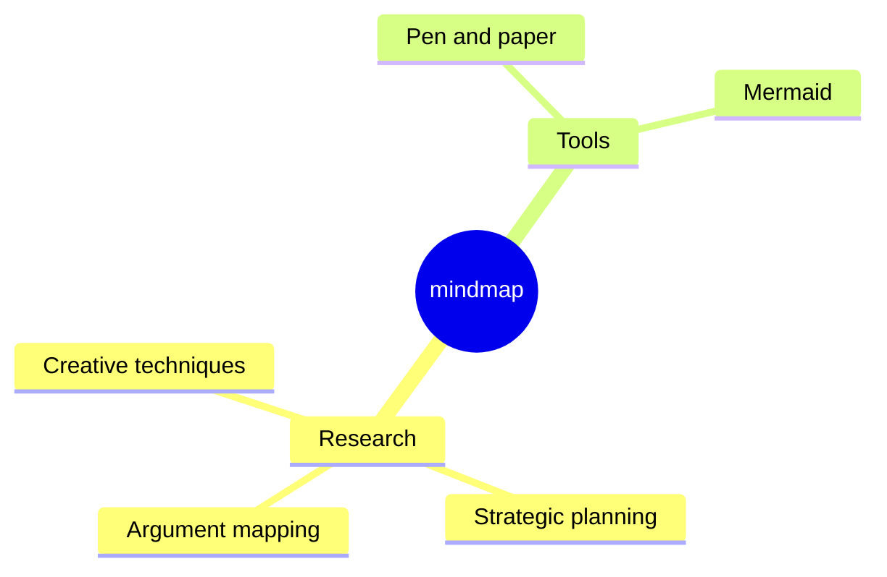

今天，我們很高興宣布 **Docusaurus 3.0** 正式發布！🥳

在 [**Meta 開源專案**](https://opensource.fb.com/) 中，我們相信 Docusaurus 能協助您以 **最小精力** 打造 **最佳文檔網站**，讓您專注於真正重要的事：撰寫內容。

這是 Docusaurus 的 **全新主版本**，帶來 **令人振奮的新功能** 與升級的依賴項。

遵循 [**語意化版本控制**](https://semver.org/) 原則，此版本包含我們詳盡記錄於 [**v3 升級指南**](/docs/migration/v3/) 的 **重大變更**。雖然重大變更可能帶來不便，但這是為 Docusaurus 未來計劃實現的 **新一波功能** 奠定基礎的必要之舉。


我們原本計劃更頻繁地發布主版本，但 Docusaurus v3 的開發時間比預期更長。在累積的重大變更中，**升級至 MDX v3** 可能是採用此新版本的主要挑戰。我們加倍努力使此升級過程盡可能順利，特別是透過新增 [MDX v1 的相容性選項](/docs/api/docusaurus-config#markdown)。

最簡單的網站只需升級少數 npm 依賴項。對於較複雜的網站，我們提出幾項策略幫助您更有信心地完成升級：

- 提前 [準備您的網站](/blog/preparing-your-site-for-docusaurus-v3)，逐步進行調整，同時保持使用 Docusaurus v2
- [設置視覺回歸測試](/blog/upgrading-frontend-dependencies-with-confidence-using-visual-regression-testing) 以捕捉升級過程中意外的視覺變化

:::info[關於 Docusaurus v2]

根據我們的 [發布流程](/community/release-process)，Docusaurus v2 現已進入 **維護模式**。在 2024 年 1 月 31 日前的 3 個月內，僅會針對重大安全性問題提供支援。建議在此時間範圍內升級至 v3 版本。

:::

import IframeWindow from '@site/src/components/BrowserWindow/IframeWindow';

## 重大變更

本節僅提供快速概覽。所有重大變更均詳盡記錄於 [**v3 升級指南**](/docs/migration/v3)。

Docusaurus v3 將多個依賴項升級至新主版本，每個升級均伴隨其自身的重大變更：

- Node.js v16 ➡️ v18
- React v17 ➡️ v18
- MDX v1 ➡️ v3
- TypeScript v4 ➡️ v5
- prism-react-renderer v1 ➡️ v2
- react-live v2 ➡️ v4
- Mermaid v9 ➡️ v10
- import-fresh v3 ➡️ jiti v1
- remark-emoji v2 ➡️ v4

典型的 `package.json` 依賴項升級範例如下：

```diff title="package.json"
 {
   "dependencies": {
     // upgrade to Docusaurus v3
-    "@docusaurus/core": "2.4.3",
-    "@docusaurus/preset-classic": "2.4.3",
+    "@docusaurus/core": "3.0.0",
+    "@docusaurus/preset-classic": "3.0.0",
     // upgrade to MDX v3
-    "@mdx-js/react": "^1.6.22",
+    "@mdx-js/react": "^3.0.0",
     // upgrade to prism-react-renderer v2.0+
-    "prism-react-renderer": "^1.3.5",
+    "prism-react-renderer": "^2.1.0",
     // upgrade to React v18.0+
-    "react": "^17.0.2",
-    "react-dom": "^17.0.2"
+    "react": "^18.2.0",
+    "react-dom": "^18.2.0"
   },
   "devDependencies": {
     // upgrade Docusaurus dev dependencies to v3
-    "@docusaurus/module-type-aliases": "2.4.3",
-    "@docusaurus/types": "2.4.3"
+    "@docusaurus/module-type-aliases": "3.0.0",
+    "@docusaurus/types": "3.0.0"
   }
   "engines": {
     // require Node.js 18.0+
-    "node": ">=16.14"
+    "node": ">=18.0"
   }
 }
```

除 MDX v3 外，大多數伴隨這些升級依賴項而來的重大變更已由我們內部處理完畢：多數情況下您無需採取任何行動。在依賴項之外，明確源自 Docusaurus 程式碼庫的功能性重大變更僅有：

- [#9189](https://github.com/facebook/docusaurus/pull/9189)：新版部落格 RSS 饋送預設限制為 20 條目
- [#9308](https://github.com/facebook/docusaurus/pull/9308)：修正並重新引入 `:::warning` 警告標示，棄用 `:::caution`
- [#9310](https://github.com/facebook/docusaurus/pull/9310)：移除舊版版本化側邊欄 ID 前綴，適用於 `v2.0.0-beta.10` 之前（2021 年 12 月）版本化的網站
- [#7966](https://github.com/facebook/docusaurus/pull/7966)：重構文檔主題元件，最終需要您重新進行 swizzle 操作

## 重點功能

以下是非詳盡的新版本實用功能列表。所有功能均列於 [**Docusaurus v3.0.0 版本說明**](https://github.com/facebook/docusaurus/releases/tag/v3.0.0)。

### Markdown

Docusaurus v3 從 MDX v1 升級至 MDX v3：

- 在 [#8288](https://github.com/facebook/docusaurus/pull/8288) 中，我們升級至 [**MDX v2**](https://mdxjs.com/blog/v2/) ([遷移指南](https://mdxjs.com/migrating/v2/))
- 在 [#9451](https://github.com/facebook/docusaurus/pull/9451) 中，我們升級至 [**MDX v3**](https://mdxjs.com/blog/v3/) ([遷移指南](https://mdxjs.com/migrating/v3/))

此新版 MDX 對**內容撰寫者與插件開發者更為友善**，並為實現新穎的 Markdown 功能奠定基礎。

:::warning[MDX v3 - 主要挑戰]

從 MDX v1 過渡至 MDX v3 是採用 Docusaurus v3 的**主要挑戰**。

部分在 Docusaurus v2 成功編譯的文件，現在可能在 Docusaurus v3 下**編譯失敗**，或呈現**不同結果**。

多數重大變更源自 [MDX v2](https://mdxjs.com/blog/v2/)，而 [MDX v3](https://mdxjs.com/blog/v3/) 屬相對小幅更新。[MDX v2 遷移指南](https://mdxjs.com/migrating/v2/)中的[更新 MDX 文件](https://mdxjs.com/migrating/v2/#update-mdx-files)章節對我們特別重要。另請務必閱讀[MDX 疑難排解](https://mdxjs.com/docs/troubleshooting-mdx/)頁面，協助解讀常見 MDX 錯誤訊息。

**無需畏懼**。多數問題**易於修復**，通常與需轉義的 `{` 和 `<` 字元有關。但根據網站規模，您可能需要編輯大量文件而感到壓力。因此，我們提供 [`npx docusaurus-mdx-checker`](https://github.com/slorber/docusaurus-mdx-checker) 指令協助評估工作量，並建議[預先準備網站](/blog/preparing-your-site-for-docusaurus-v3)。

若您曾自訂 [MDX 插件](/docs/markdown-features/plugins)（Remark/Rehype），由於 AST 略有差異，可能需要重構它們。

:::

這使我們得以新增[CommonMark 模式](/docs/markdown-features#mdx-vs-commonmark)，讓現有文件更容易採用 Docusaurus。目前此功能為選用且**實驗性**，功能有限（[部分 Docusaurus 功能將無法運作](https://github.com/facebook/docusaurus/issues/9092)）。在 Docusaurus v3 中，所有檔案仍以 MDX 解析，但我們計劃在未來主要版本中將 `.md` 檔案解析為 CommonMark，並建議對使用 JSX 或 ES 模組的檔案採用 `.mdx` 副檔名。

我們也引入新的[全域 Markdown 設定方式](/docs/api/docusaurus-config#markdown)，並計劃後續增加更多彈性選項。

```js title="docusaurus.config.js"
export default {
  markdown: {
    format: 'mdx',
    mermaid: true,
    preprocessor: ({filePath, fileContent}) => {
      return fileContent.replaceAll('{{MY_VAR}}', 'MY_VALUE');
    },
    mdx1Compat: {
      comments: true,
      admonitions: true,
      headingIds: true,
    },
  },
};
```

Docusaurus 現採用 [remark-directive](https://github.com/remarkjs/remark-directive) 插件支援 admonitions。這也讓您能透過自訂 [directive](https://talk.commonmark.org/t/generic-directives-plugins-syntax/444)（如 `:textDirective`、`::leafDirective` 或 `:::containerDirective`）擴展 Markdown 功能。

### ESM 與 TypeScript 設定 {#esm-ts-configs}

在 [#9317](https://github.com/facebook/docusaurus/pull/9317) 中，我們新增了對 ES 模組和 TypeScript 設定檔的支援，包括網站設定、文件側邊欄、外掛和預設配置。

以下是兩個 TypeScript 範例，提供您現代化的 IDE 自動完成體驗：

```ts title="docusaurus.config.ts"
import type {Config} from '@docusaurus/types';
import type * as Preset from '@docusaurus/preset-classic';

const config: Config = {
  title: 'My Site',
  favicon: 'img/favicon.ico',
  // your site config ...
  presets: [
    [
      'classic',
      {
        // your preset config ...
      } satisfies Preset.Options,
    ],
  ],
  themeConfig: {
    // your theme config ...
  } satisfies Preset.ThemeConfig,
};

export default config;
```

```ts title="sidebars.ts"
import type {SidebarsConfig} from '@docusaurus/plugin-content-docs';

const sidebars: SidebarsConfig = {
  docs: ['introduction'],
};

export default sidebars;
```

### 未列出的內容

Docusaurus 已在我們的 3 個內容外掛（文件、部落格、頁面）中支援 `draft: true` 前置元數據選項，允許您從生產版本中移除某些頁面。

在 [#8004](https://github.com/facebook/docusaurus/pull/8004) 中，我們引入了一個新的 `unlisted: true` 前置元數據選項，這將使您的頁面在生產版本中保持可用，同時「隱藏」它們，除非您擁有該 URL，否則無法發現。這使得在最終發布前輕鬆徵求內容反饋的工作流程成為可能。

未列出的內容將會：

- 從 `sitemap.xml` 中排除
- 通過 `<meta name="robots" content="noindex, nofollow" />` 從 SEO 結果中排除
- 從部落格 RSS 訂閱中排除
- 從 Algolia DocSearch 結果中排除
- 從網站導航欄項目、文件側邊欄、部落格側邊欄、部落格存檔、標籤頁面等中過濾掉

未列出的內容還會顯示一個橫幅，以便您在內容準備好正式發布時不會忘記關閉它。這裡有一個[未列出的部落格文章](/tests/blog/unlisted-post)範例：

<IframeWindow url="/tests/blog/unlisted-post" />

### React 18

在 [#8961](https://github.com/facebook/docusaurus/pull/8961) 中，我們升級到了 React 18。這很重要，特別是對於[逐步採用 Concurrent React 功能](https://react.dev/blog/2022/03/29/react-v18#gradually-adopting-concurrent-features)，以及即將推出的令人興奮的功能，如[構建時 React Server Components](https://github.com/facebook/docusaurus/issues/9089)。

這個新版本的 React 對於大多數 Docusaurus 網站來說應該是無縫替換的。它帶來的破壞性變更我們已在 Docusaurus 代碼庫內部處理。如果您的網站使用了大量自定義 React 代碼，我們建議您查看官方文章[如何升級到 React 18](https://react.dev/blog/2022/03/08/react-18-upgrade-guide)，特別是新的[自動批處理](https://react.dev/blog/2022/03/08/react-18-upgrade-guide#automatic-batching)行為。

:::danger[對 React 18 功能的實驗性支援]

React 18 帶來了新功能：

- `<Suspense>`
- `React.lazy()`
- `startTransition()`

它們在 Docusaurus 中的支援被視為**實驗性**。我們未來可能需要調整整合方式，導致運行時行為有所不同。

:::

### 自動 JSX 運行時

Docusaurus 現在使用[「自動」JSX 運行時](https://legacy.reactjs.org/blog/2020/09/22/introducing-the-new-jsx-transform.html)。

在未使用任何 React API 的 JSX 文件中，不再需要導入 React。

```diff title="src/components/MyComponent.js"
- import React from 'react';

  export default function MyComponent() {
    return <div>Hello</div>;
  }
```

### 除錯版本

現在可以在開發模式下構建您的靜態網站。

```bash
docusaurus build --dev
```

:::tip[除錯 React 相關問題]

Docusaurus 將在控制台中記錄更多錯誤，特別是通過新的 [`onRecoverableError` 回調](https://react.dev/reference/react-dom/client/hydrateRoot#parameters)記錄的 React 18 水合錯誤。

這個新的構建模式對於**排查 React 問題**特別有幫助。Docusaurus 將使用 React 的開發構建，從而產生詳細且可讀的錯誤訊息，而不是鏈接到 [React 錯誤解碼器頁面](https://reactjs.org/docs/error-decoder.html/)的壓縮訊息。

:::

### TypeScript

Docusaurus v3 現在需要 TypeScript 5.0 作為最低版本要求。

我們將基礎推薦的 TypeScript 配置重新內化到一個新的官方套件中：

```diff title="tsconfig.json"
 {
-  "extends": "@tsconfig/docusaurus/tsconfig.json",
+  "extends": "@docusaurus/tsconfig",
   "compilerOptions": {
     "baseUrl": "."
   }
 }
```

我們還為 Docusaurus 核心類型、插件和預設選項提供了更清晰、標準化的導出，您可以在全新的 [TypeScript 配置檔案](#esm-ts-configs) 中使用：

```ts title="docusaurus.config.ts"
import type {Config} from '@docusaurus/types';
import type {Options, ThemeConfig} from '@docusaurus/preset-classic';
import type {SidebarsConfig} from '@docusaurus/plugin-content-docs';
```

### 程式碼區塊

在 [#9316](https://github.com/facebook/docusaurus/pull/9316) 中，我們透過升級 [prism-react-renderer](https://github.com/FormidableLabs/prism-react-renderer) v2 改善了語法突顯功能。例如，bash 參數 `--save` 現在會顯示顏色：

```bash
npm install --save some-package
```

[互動式程式碼編輯器](/docs/markdown-features/code-blocks#interactive-code-editor) 也升級至 [react-live](https://github.com/FormidableLabs/react-live) v4，並採用新的 [sucrase](https://github.com/alangpierce/sucrase) 編譯器。它更快、更輕量，並支援現代功能，特別是 TypeScript 類型註解。

```js live
function Hello() {
  const name: string = 'World';
  return <div>Hello {name}</div>;
}
```

在 [#8982](https://github.com/facebook/docusaurus/pull/8982) 和 [#8870](https://github.com/facebook/docusaurus/pull/8870) 中，我們還為 TeX 風格、Haskell 風格和 WebAssembly 註解語法新增了 [魔法註解](/docs/markdown-features/code-blocks#custom-magic-comments) 支援。

```haskell title="haskell.hs"
stringLength :: String -> Int
-- highlight-next-line
stringLength [] = 0
stringLength (x:xs) = 1 + stringLength xs
```

```matlab title="matlab.m"
% highlight-start
function result = times2(n)
  result = n * 2;
end
% highlight-end
x = 10;
% highlight-next-line
y = times2(x);
```

### Mermaid 圖表

在 [#9305](https://github.com/facebook/docusaurus/pull/9305) 中，我們升級至 Mermaid v10.4 並新增了非同步圖表渲染支援。Docusaurus 現在能夠渲染新型態的圖表。

<details>
  <summary>Mindmap</summary>



</details>

<details>
  <summary>Quadrant chart</summary>


</details>

### 查詢字串資料屬性

在 [#9028](https://github.com/facebook/docusaurus/pull/9028) 中，我們實現了透過 `docusaurus-data-x` 查詢字串參數設定自訂 HTML [資料屬性](https://developer.mozilla.org/en-US/docs/Web/HTML/Global_attributes/data-*)。這使得在其他網站上嵌入 Docusaurus iframe 更加容易，並讓您能透過 CSS 自訂嵌入版本的外觀。

```css title="/src/css/custom.css"
html[data-navbar='false'] .navbar {
  display: none;
}

html[data-red-border] div#__docusaurus {
  border: red solid thick;
}
```

<IframeWindow url="/docs/?docusaurus-data-navbar=false&docusaurus-data-red-border" />

### 其他功能

其他值得注意的新功能：

- [#9189](https://github.com/facebook/docusaurus/pull/9189)：新增部落格 `feedOptions.limit` 選項
- [#9071](https://github.com/facebook/docusaurus/pull/9071)：為頁面插件新增標準化 SEO 前置資料支援
- [#9171](https://github.com/facebook/docusaurus/pull/9028)：客戶端重定向插件現在支援完整限定網址和目標網址中的查詢字串/雜湊
- [#9171](https://github.com/facebook/docusaurus/pull/9171)：新增 ESLint 規則 [`no-html-links`](/docs/api/misc/@docusaurus/eslint-plugin/no-html-links)
- [#8384](https://github.com/facebook/docusaurus/pull/8384)：新增 ESLint 規則 [`prefer-docusaurus-heading`](/docs/api/misc/@docusaurus/eslint-plugin/prefer-docusaurus-heading)

請閱讀 [**Docusaurus v3.0.0 版本說明**](https://github.com/facebook/docusaurus/releases/tag/v3.0.0) 以獲取完整的變更清單。

## 結論

此版本帶來了一些功能，但更重要的是 **升級了 Docusaurus 基礎架構的許多部分**。

**MDX 升級** 今年耗費了我們大量時間，我們努力使這個重要升級對所有人來說不那麼困難。

現在我們已完成了基礎架構的更新，很快將在接下來的次要版本中**持續推出實用的文件功能**。

我們要感謝您多年來使用 Docusaurus。近期文件框架領域的競爭日益激烈，我們將竭盡所能確保 Docusaurus 保持其**卓越靈活性**，成為脫穎而出的**競爭力解決方案**。