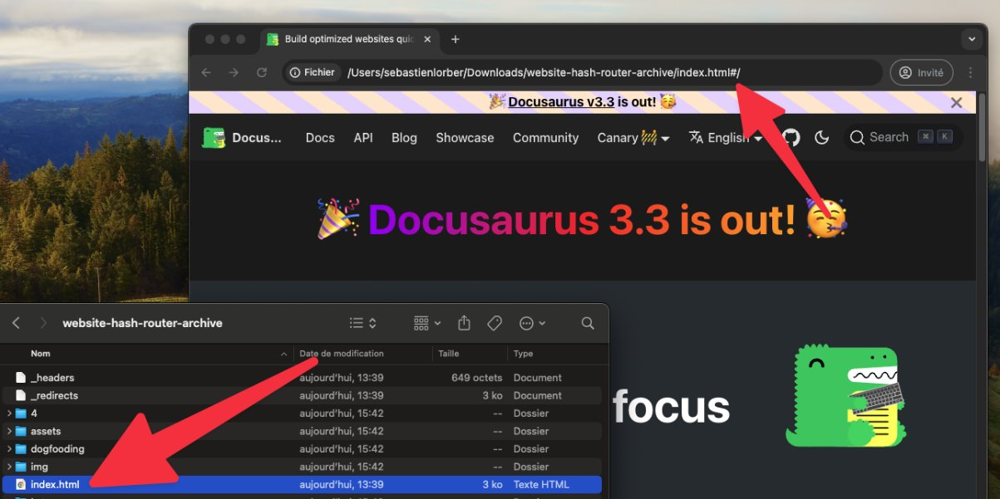

我們很高興宣布 **Docusaurus 3.4** 版本發布。

升級過程應該很簡單。我們的[發布流程](/community/release-process)遵循[語意化版本控制](https://semver.org/)。次要版本不包含任何破壞性變更。


<!--truncate-->

## 重點功能

### 標籤檔案

文件與部落格插件原本就支援 front matter 中的 `tags` 屬性，讓您能將相關內容分組。但直接在 front matter 中聲明標籤並非總是理想做法。

透過 [#10137](https://github.com/facebook/docusaurus/pull/10137)，您現在可以在 `tags.yml` 檔案中預先定義標籤列表：

```yml title="blog/tags.yml"
tag1:
  label: 'Tag 1'
  description: 'Tag 1 description'
  permalink: /tag-1-permalink

tag2:
  label: 'Tag 2'
  description: 'Tag 2 description'
  permalink: /tag-2-permalink
```

這些預定義標籤可用於部落格或文件檔案的 front matter 中：

```md title="blog/2024-05-31-my-blog-post.md"
---
tags: [tag1, tag2]
---

# Title

Content
```

:::tip[保持標籤使用一致性]

使用新的 `onInlineTags: 'throw'` 插件選項來強制使用預定義標籤，防止貢獻者創建新的非預期標籤。

:::

### 哈希路由 - 實驗性功能

透過 [9859](https://github.com/facebook/docusaurus/pull/9859)，我們新增了實驗性的哈希路由配置選項，這對於透過 `file://` 協議在本機開啟網站進行**離線瀏覽**非常有用。

```tsx title="docusaurus.config.js"
export default {
  future: {
    experimental_router: 'hash',
  },
};
```

:::warning

此模式**不建議用於透過網頁伺服器部署的網站**。

:::

啟用此模式時，Docusaurus 將退出靜態網站渲染，並構建一個客戶端單頁應用程式，其中所有路由都以前綴 `/#/` 開頭。會生成單一的 `index.html` 檔案。此檔案可直接在瀏覽器中點擊開啟，使用瀏覽器的 `file://` 協議。這使得可以將 Docusaurus 網站作為 `.zip` 檔案分發，讓讀者無需在電腦上安裝複雜的軟體，僅需網頁瀏覽器即可離線瀏覽。



試試瀏覽我們使用哈希路由構建的 Docusaurus 網站：

- [Docusaurus 網站 - 哈希路由網頁部署](https://facebook.github.io/docusaurus/#/)
- [Docusaurus 網站 - 哈希路由可下載的 GitHub 成品](https://github.com/facebook/docusaurus/actions/workflows/build-hash-router.yml)

:::caution[實驗性]

此功能為**實驗性質**。如果您試用，請[在此](https://github.com/facebook/docusaurus/issues/3825)告訴我們使用體驗。

:::

### 網站儲存 - 實驗性功能

Docusaurus 使用瀏覽器的 `localStorage` API 來持久化 UI 狀態。

但有時儲存空間會被使用相同網域的多個網站「共享」，導致**儲存鍵衝突**。這通常發生在兩種情況：

- 當在多個 `http://localhost:3000` 網站上工作時
- 當在同一個網域下托管多個網站時：`https://example.com/site1/` 和 `https://example.com/site2/`

因此，我們引入了新的**實驗性** `siteStorage` 配置選項：

```tsx
export default {
  future: {
    experimental_storage: {
      type: 'localStorage',
      namespace: true,
    },
  },
};
```

當設置 `namespace: true` 時，我們會為所有儲存鍵添加哈希後綴，使其基於 `config.url` 和 `config.baseUrl` 成為當前網站專屬。例如，`theme` 儲存鍵會變成 `theme-x6f`。您也可以提供自定義後綴 `namespace: 'suffix'`。我們還實現了可使用 `type: 'sessionStorage'` 來替代預設的 `localStorage`。

:::caution[實驗性功能]

此功能目前處於**實驗階段**。若您嘗試使用，請於[此處](https://github.com/facebook/docusaurus/pull/10121)回報使用體驗。

:::

## 其他變更

其他值得注意的變更包括：

- [#10151](https://github.com/facebook/docusaurus/pull/10151)：新增土庫曼語(tk)主題翻譯
- [#10111](https://github.com/facebook/docusaurus/pull/10111)：新增保加利亞語(bg)主題翻譯  
- [#10168](https://github.com/facebook/docusaurus/pull/10168)：修復多個長期存在的Markdown連結解析錯誤
- [#10178](https://github.com/facebook/docusaurus/pull/10178)：`/search`頁面現在會遵循`contextualSearch: false`設定
- [#10118](https://github.com/facebook/docusaurus/pull/10118)：修正文件生成索引分類卡描述中的錯誤複數形式
- [#10130](https://github.com/facebook/docusaurus/pull/10130)：修復因尾隨斜線導致錨點檢查器誤報的問題

完整變更清單請參閱**[3.4.0版本更新日誌](/changelog/3.4.0)**。