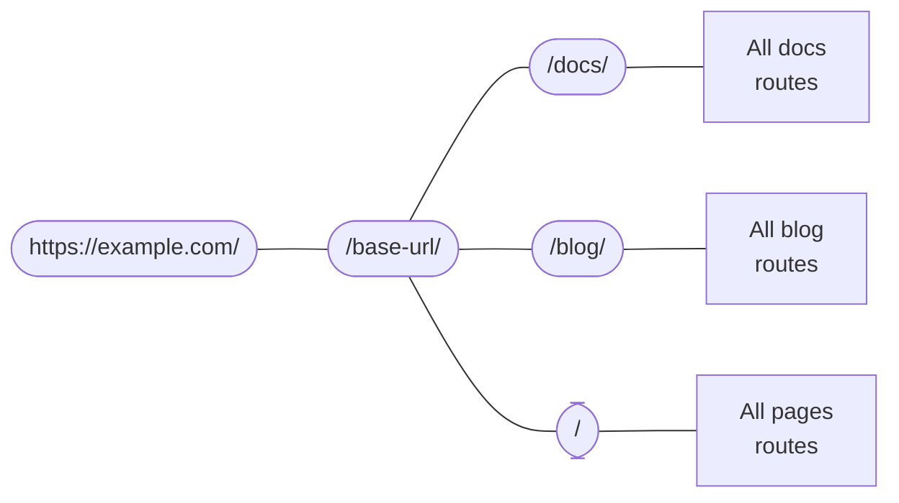

# 路由系統

```mdx-code-block
import Link from '@docusaurus/Link';
import {useLatestVersion, useActiveDocContext} from '@docusaurus/plugin-content-docs/client';
import {useLocation} from '@docusaurus/router';
import BrowserWindow from '@site/src/components/BrowserWindow';
```

Docusaurus 的路由系統遵循單頁應用程式慣例：一個路由對應一個元件。本節將先介紹三種內容外掛（文檔、部落格和頁面）內的路由機制，接著深入探討底層路由系統的運作原理。

## 內容外掛中的路由 {#routing-in-content-plugins}

每個內容外掛都提供 `routeBasePath` 選項，用於定義外掛路由的基礎路徑。預設情況下，文檔外掛的路由位於 `/docs` 下；部落格外掛位於 `/blog`；頁面外掛則位於 `/`。您可以將路由結構視為：



系統會將所有路由與此嵌套路由配置進行匹配，直到找到相符項目。例如當訪問 `/docs/configuration` 路由時，Docusaurus 會先進入 `/docs` 分支，再於文檔外掛創建的子路由中搜尋。

修改 `routeBasePath` 可有效變更網站路由結構。例如在[純文檔模式](../guides/docs/docs-introduction.mdx#docs-only-mode)中，將文檔外掛設為 `routeBasePath: '/'` 意味著文檔路由將不再有 `/docs` 前綴，但仍可保留其他外掛創建的子路由（如 `/blog`）。

接下來我們將分別說明三種外掛如何組織其「子路由容器」。

### 頁面路由 {#pages-routing}

頁面路由最為直觀：檔案路徑直接映射為 URL，無法透過其他方式自訂。詳見[頁面文檔](../guides/creating-pages.mdx#routing)。

Markdown 頁面使用 `@theme/MDXPage` 元件，React 頁面則直接作為路由元件使用。

### 部落格路由 {#blog-routing}

部落格會創建以下路由：

- **文章列表頁**：`/`, `/page/2`, `/page/3`...
  - 使用元件 `@theme/BlogListPage`。
- **單篇文章頁**：`/2021/11/21/algolia-docsearch-migration`, `/2021/05/12/announcing-docusaurus-two-beta`...
  - 由各篇 Markdown 文章生成。
  - 路由可透過 front matter 的 `slug` 完全自訂。
  - 使用元件 `@theme/BlogPostPage`。
- **標籤列表頁**：`/tags`
  - 路由可透過 `tagsBasePath` 選項調整。
  - 使用元件 `@theme/BlogTagsListPage`。
- **標籤頁**：`/tags/adoption`, `/tags/beta`...
  - 根據文章 front matter 中定義的標籤生成。
  - 基礎路由由 `tagsBasePath` 決定，子路由可透過標籤的 `permalink` 欄位自訂。
  - 使用元件 `@theme/BlogTagsPostsPage`。
- **歸檔頁**：`/archive`
  - 路由可透過 `archiveBasePath` 選項調整。
  - 使用元件 `@theme/BlogArchivePage`。

### 文檔路由 {#docs-routing}

文檔外掛是唯一會創建**嵌套路由**的外掛。頂層會註冊[版本路徑](../guides/docs/versioning.mdx)：`/`, `/next`, `/2.0.0-beta.13`... 這些路徑提供版本上下文（包含版面配置與側邊欄），確保切換文檔時能保持側邊欄狀態，並可透過導航欄下拉選單切換版本而不離開當前文檔。使用的元件為 `@theme/DocPage`。

```mdx-code-block
export const URLPath = () => <code>{useLocation().pathname}</code>;

export const FilePath = () => {
  const currentVersion = useActiveDocContext('default').activeVersion.name;
  return <code>{currentVersion === 'current' ? './docs/' : `./versioned_docs/version-${currentVersion}/`}advanced/routing.md</code>;
}
```

個別文檔會渲染在導航欄、頁尾、側邊欄等元件提供的剩餘空間中。例如本頁面 <URLPath /> 是由檔案 <FilePath /> 生成，使用的元件為 `@theme/DocItem`。

The doc's `slug` front matter customizes the last part of the route, but the base route is always defined by the plugin's `routeBasePath` and the version's `path`.

### File paths and URL paths {#file-paths-and-url-paths}

Throughout the documentation, we always try to be unambiguous about whether we are talking about file paths or URL paths. Content plugins usually map file paths directly to URL paths, for example, `./docs/advanced/routing.md` will become `/docs/advanced/routing`. However, with `slug`, you can make URLs totally decoupled from the file structure.

When writing links in Markdown, you could either mean a _file path_, or a _URL path_, which Docusaurus would use several heuristics to determine.

- If the path has a `@site` prefix, it is _always_ an asset file path.
- If the path has an `http(s)://` prefix, it is _always_ a URL path.
- If the path doesn't have an extension, it is a URL path. For example, a link `[page](../plugins)` on a page with URL `/docs/advanced/routing` will link to `/docs/plugins`. Docusaurus will only detect broken links when building your site (when it knows the full route structure), but will make no assumptions about the existence of a file. It is exactly equivalent to writing `<a href="../plugins">page</a>` in a JSX file.
- If the path has an `.md(x)` extension, Docusaurus would try to resolve that Markdown file to a URL, and replace the file path with a URL path.
- If the path has any other extension, Docusaurus would treat it as [an asset](../guides/markdown-features/markdown-features-assets.mdx) and bundle it.

The following directory structure may help you visualize this file → URL mapping. Assume that there's no slug customization in any page.

<details>

<summary>A sample site structure</summary>

```bash
.
├── blog                            # blog plugin has routeBasePath: '/blog'
│   ├── 2019-05-28-first-blog-post.md       # -> /blog/2019/05/28/first-blog-post
│   ├── 2019-05-29-long-blog-post.md        # -> /blog/2019/05/29/long-blog-post
│   ├── 2021-08-01-mdx-blog-post.mdx        # -> /blog/2021/08/01/mdx-blog-post
│   └── 2021-08-26-welcome
│       ├── docusaurus-plushie-banner.jpeg
│       └── index.md                        # -> /blog/2021/08/26/welcome
├── docs                            # docs plugin has routeBasePath: '/docs'; current version has base path '/'
│   ├── intro.md                            # -> /docs/intro
│   ├── tutorial-basics
│   │   ├── _category_.json
│   │   ├── congratulations.md              # -> /docs/tutorial-basics/congratulations
│   │   └── markdown-features.mdx           # -> /docs/tutorial-basics/markdown-features
│   └── tutorial-extras
│       ├── _category_.json
│       ├── manage-docs-versions.md         # -> /docs/tutorial-extras/manage-docs-versions
│       └── translate-your-site.md          # -> /docs/tutorial-extras/translate-your-site
├── src
│   └── pages                       # pages plugin has routeBasePath: '/'
│       ├── index.module.css
│       ├── index.tsx                       # -> /
│       └── markdown-page.md                # -> /markdown-page
└── versioned_docs
    └── version-1.0.0               # version has base path '/1.0.0'
        ├── intro.md                        # -> /docs/1.0.0/intro
        ├── tutorial-basics
        │   ├── _category_.json
        │   ├── congratulations.md          # -> /docs/1.0.0/tutorial-basics/congratulations
        │   └── markdown-features.mdx       # -> /docs/1.0.0/tutorial-basics/markdown-features
        └── tutorial-extras
            ├── _category_.json
            ├── manage-docs-versions.md     # -> /docs/1.0.0/tutorial-extras/manage-docs-versions
            └── translate-your-site.md      # -> /docs/1.0.0/tutorial-extras/translate-your-site
```

</details>

So much about content plugins. Let's take one step back and talk about how routing works in a Docusaurus app in general.

## Routes become HTML files {#routes-become-html-files}

Because Docusaurus is a server-side rendering framework, all routes generated will be server-side rendered into static HTML files. If you are familiar with the behavior of HTTP servers like [Apache2](https://httpd.apache.org/docs/trunk/getting-started.html), you will understand how this is done: when the browser sends a request to the route `/docs/advanced/routing`, the server interprets that as request for the HTML file `/docs/advanced/routing/index.html`, and returns that.

The `/docs/advanced/routing` route can correspond to either `/docs/advanced/routing/index.html` or `/docs/advanced/routing.html`. Some hosting providers differentiate between them using the presence of a trailing slash, and may or may not tolerate the other. Read more in the [trailing slash guide](https://github.com/slorber/trailing-slash-guide).

For example, the build output of the directory above is (ignoring other assets and JS bundle):

<details>

<summary>Output of the above workspace</summary>

```bash
build
├── 404.html                      # /404/
├── blog
│   ├── archive
│   │   └── index.html            # /blog/archive/
│   ├── first-blog-post
│   │   └── index.html            # /blog/first-blog-post/
│   ├── index.html                # /blog/
│   ├── long-blog-post
│   │   └── index.html            # /blog/long-blog-post/
│   ├── mdx-blog-post
│   │   └── index.html            # /blog/mdx-blog-post/
│   ├── tags
│   │   ├── docusaurus
│   │   │   └── index.html        # /blog/tags/docusaurus/
│   │   ├── hola
│   │   │   └── index.html        # /blog/tags/hola/
│   │   └── index.html            # /blog/tags/
│   └── welcome
│       └── index.html            # /blog/welcome/
├── docs
│   ├── 1.0.0
│   │   ├── intro
│   │   │   └── index.html        # /docs/1.0.0/intro/
│   │   ├── tutorial-basics
│   │   │   ├── congratulations
│   │   │   │   └── index.html    # /docs/1.0.0/tutorial-basics/congratulations/
│   │   │   └── markdown-features
│   │   │       └── index.html    # /docs/1.0.0/tutorial-basics/markdown-features/
│   │   └── tutorial-extras
│   │       ├── manage-docs-versions
│   │       │   └── index.html    # /docs/1.0.0/tutorial-extras/manage-docs-versions/
│   │       └── translate-your-site
│   │           └── index.html    # /docs/1.0.0/tutorial-extras/translate-your-site/
│   ├── intro
│   │   └── index.html            # /docs/1.0.0/intro/
│   ├── tutorial-basics
│   │   ├── congratulations
│   │   │   └── index.html        # /docs/tutorial-basics/congratulations/
│   │   └── markdown-features
│   │       └── index.html        # /docs/tutorial-basics/markdown-features/
│   └── tutorial-extras
│       ├── manage-docs-versions
│       │   └── index.html        # /docs/tutorial-extras/manage-docs-versions/
│       └── translate-your-site
│           └── index.html        # /docs/tutorial-extras/translate-your-site/
├── index.html                    # /
└── markdown-page
    └── index.html                # /markdown-page/
```

</details>

If `trailingSlash` is set to `false`, the build would emit `intro.html` instead of `intro/index.html`.

All HTML files will reference its JS assets using absolute URLs, so in order for the correct assets to be located, you have to configure the `baseUrl` field. Note that `baseUrl` doesn't affect the emitted bundle's file structure: the base URL is one level above the Docusaurus routing system. You can see the aggregate of `url` and `baseUrl` as the actual location of your Docusaurus site.

舉例來說，產生的 HTML 檔案會包含像 `<link rel="preload" href="/assets/js/runtime~main.7ed5108a.js" as="script">` 這樣的連結。由於絕對 URL 是從主機端解析的，若打包檔案被放置在 `https://example.com/base/` 路徑下，該連結會指向不存在的 `https://example.com/assets/js/runtime~main.7ed5108a.js`。透過指定 `/base/` 作為基礎 URL，連結才能正確指向 `/base/assets/js/runtime~main.7ed5108a.js`。

在地化網站的基礎 URL 也會包含語系代碼。例如 `https://docusaurus.io/zh-CN/docs/advanced/routing/` 的基礎 URL 為 `/zh-CN/`。

## 路由的生成與存取 {#generating-and-accessing-routes}

`addRoute` 生命週期方法用於生成路由，它會將路由配置註冊到路由樹中，包含路由路徑、對應元件及元件所需的 props。props 和元件都以打包工具可 `require` 的路徑形式提供，如[架構概述](architecture.mdx)所述，伺服器與客戶端僅透過暫存檔案溝通。

所有路由會匯總在 `.docusaurus/routes.js` 中，可透過除錯插件的[路由面板](/__docusaurus/debug/routes)檢視。

客戶端提供 `@docusaurus/router` 來存取頁面路由，該套件重新導出 [`react-router-dom`](https://www.npmjs.com/package/react-router-dom/v/5.3.0)。例如使用 `useLocation` 取得當前頁面的[位置物件](https://developer.mozilla.org/en-US/docs/Web/API/Location)，或透過 `useHistory` 存取[歷史物件](https://developer.mozilla.org/en-US/docs/Web/API/History)（功能類似瀏覽器 API 但實作不同，詳見 React Router 文件）。

此 API 具備 **SSR 安全性**，與僅限瀏覽端的 `window.location` 不同。

```jsx title="myComponent.js"
import React from 'react';
import {useLocation} from '@docusaurus/router';

export function PageRoute() {
  // React router provides the current component's route, even in SSR
  const location = useLocation();
  return (
    <span>
      We are currently on <code>{location.pathname}</code>
    </span>
  );
}
```

```mdx-code-block
export function PageRoute() {
  const location = useLocation();
  return (
    <span>
      We are currently on <code>{location.pathname}</code>
    </span>
  );
}

<BrowserWindow>

<PageRoute />

</BrowserWindow>
```

## 脫離 SPA 轉跳機制 {#escaping-from-spa-redirects}

Docusaurus 建構的是[單頁應用程式](https://developer.mozilla.org/en-US/docs/Glossary/SPA)，路由轉換透過 React Router 的 `history.push()` 方法在客戶端完成。此機制前提是目標 URL 必須存在於路由系統中，否則會觸發 404 頁面。

若將 HTML 檔案置於 `static` 資料夾，它們會被複製到建置輸出中成為可存取內容，但不屬於 Docusaurus 路由系統。我們提供 `pathname://` 協定，可像外部連結般以非 SPA 方式跳轉至網站其他部分。

```md
- [pathname:///pure-html](pathname:///pure-html)
```

<BrowserWindow>

- [`pathname:///pure-html`](pathname:///pure-html)

</BrowserWindow>

`pathname://` 協定特別適合參照 static 資料夾內容。例如 Docusaurus 會將[所有 Markdown 靜態資源轉為 require() 呼叫](../guides/markdown-features/markdown-features-assets.mdx#static-assets)，使用此協定可保持原始連結形式，避免被 Webpack 雜湊處理。

```md title="my-doc.md"


[An asset from the static](pathname:///files/asset.pdf)
```

Docusaurus 僅會移除 `pathname://` 前綴，不會處理後續內容。