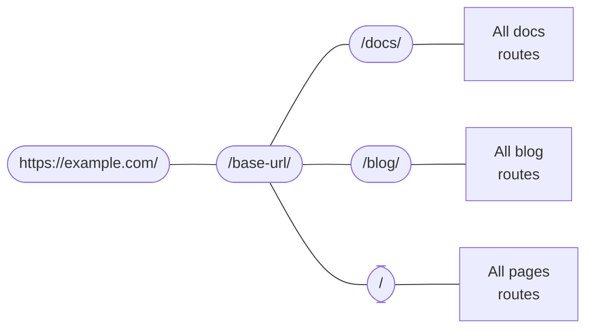

# Routing

```mdx-code-block
import Link from '@docusaurus/Link';
import {useLatestVersion, useActiveDocContext} from '@docusaurus/plugin-content-docs/client';
import {useLocation} from '@docusaurus/router';
import BrowserWindow from '@site/src/components/BrowserWindow';
```

Docusaurus' routing system follows single-page application conventions: one route, one component. In this section, we will begin by talking about routing within the three content plugins (docs, blog, and pages), and then go beyond to talk about the underlying routing system.

## Routing in content plugins {#routing-in-content-plugins}

Every content plugin provides a `routeBasePath` option. It defines where the plugins append their routes to. By default, the docs plugin puts its routes under `/docs`; the blog plugin, `/blog`; and the pages plugin, `/`. You can think about the route structure like this:



Any route will be matched against this nested route config until a good match is found. For example, when given a route `/docs/configuration`, Docusaurus first enters the `/docs` branch, and then searches among the subroutes created by the docs plugin.

Changing `routeBasePath` can effectively alter your site's route structure. For example, in [Docs-only mode](../guides/docs/docs-introduction.mdx#docs-only-mode), we mentioned that configuring `routeBasePath: '/'` for docs means that all routes that the docs plugin create would not have the `/docs` prefix, yet it doesn't prevent you from having more subroutes like `/blog` created by other plugins.

Next, let's look at how the three plugins structure their own "boxes of subroutes".

### Pages routing {#pages-routing}

Pages routing are straightforward: the file paths directly map to URLs, without any other way to customize. See the [pages docs](../guides/creating-pages.mdx#routing) for more information.

The component used for Markdown pages is `@theme/MDXPage`. React pages are directly used as the route's component.

### Blog routing {#blog-routing}

The blog creates the following routes:

- **Posts list pages**: `/`, `/page/2`, `/page/3`...
  - The route is customizable through the `pageBasePath` option.
  - The component is `@theme/BlogListPage`.
- **Post pages**: `/2021/11/21/algolia-docsearch-migration`, `/2021/05/12/announcing-docusaurus-two-beta`...
  - Generated from each Markdown post.
  - The routes are fully customizable through the `slug` front matter.
  - The component is `@theme/BlogPostPage`.
- **Tags list page**: `/tags`
  - The route is customizable through the `tagsBasePath` option.
  - The component is `@theme/BlogTagsListPage`.
- **Tag pages**: `/tags/adoption`, `/tags/beta`...
  - Generated through the tags defined in each post's front matter.
  - The routes always have base defined in `tagsBasePath`, but the subroutes are customizable through the tag's `permalink` field.
  - The component is `@theme/BlogTagsPostsPage`.
- **Archive page**: `/archive`
  - The route is customizable through the `archiveBasePath` option.
  - The component is `@theme/BlogArchivePage`.

### Docs routing {#docs-routing}

The docs is the only plugin that creates **nested routes**. At the top, it registers [**version paths**](../guides/docs/versioning.mdx): `/`, `/next`, `/2.0.0-beta.13`... which provide the version context, including the layout and sidebar. This ensures that when switching between individual docs, the sidebar's state is preserved, and that you can switch between versions through the navbar dropdown while staying on the same doc. The component used is `@theme/DocPage`.

```mdx-code-block
export const URLPath = () => <code>{useLocation().pathname}</code>;

export const FilePath = () => {
  const currentVersion = useActiveDocContext('default').activeVersion.name;
  return <code>{currentVersion === 'current' ? './docs/' : `./versioned_docs/version-${currentVersion}/`}advanced/routing.md</code>;
}
```

The individual docs are rendered in the remaining space after the navbar, footer, sidebar, etc. have all been provided by the `DocPage` component. For example, this page, <URLPath />, is generated from the file at <FilePath />. The component used is `@theme/DocItem`.

文件的 `slug` 前置元數據可自訂路由的最後部分，但基礎路由始終由插件的 `routeBasePath` 和版本的 `path` 定義。

### 檔案路徑與 URL 路徑 {#file-paths-and-url-paths}

在整個文件中，我們始終力求明確區分檔案路徑和 URL 路徑。內容插件通常會將檔案路徑直接映射到 URL 路徑，例如 `./docs/advanced/routing.md` 會變成 `/docs/advanced/routing`。然而，透過 `slug` 設定，您可以讓 URL 完全與檔案結構脫鉤。

在 Markdown 中撰寫連結時，您可能指的是 _檔案路徑_ 或 _URL 路徑_，Docusaurus 會使用多種啟發式方法來判斷。

- 若路徑帶有 `@site` 前綴，則 _必定_ 是資源檔案路徑。
- 若路徑帶有 `http(s)://` 前綴，則 _必定_ 是 URL 路徑。
- 若路徑沒有副檔名，則視為 URL 路徑。例如，在 URL 為 `/docs/advanced/routing` 的頁面上，連結 `[page](../plugins)` 會指向 `/docs/plugins`。Docusaurus 僅在建置站點時（當其知曉完整路由結構時）檢測失效連結，但不會對檔案存在與否做出假設。這完全等同於在 JSX 檔案中撰寫 `<a href="../plugins">page</a>`。
- 若路徑帶有 `.md(x)` 副檔名，Docusaurus 會嘗試將該 Markdown 檔案解析為 URL，並將檔案路徑替換為 URL 路徑。
- 若路徑帶有任何其他副檔名，Docusaurus 會將其視為 [資源](../guides/markdown-features/markdown-features-assets.mdx) 並進行打包。

以下目錄結構可幫助您直觀理解這種檔案→URL的映射關係。假設所有頁面均未使用 slug 自訂功能。

<details>

<summary>A sample site structure</summary>

```bash
.
├── blog                            # blog plugin has routeBasePath: '/blog'
│   ├── 2019-05-28-first-blog-post.md       # -> /blog/2019/05/28/first-blog-post
│   ├── 2019-05-29-long-blog-post.md        # -> /blog/2019/05/29/long-blog-post
│   ├── 2021-08-01-mdx-blog-post.mdx        # -> /blog/2021/08/01/mdx-blog-post
│   └── 2021-08-26-welcome
│       ├── docusaurus-plushie-banner.jpeg
│       └── index.md                        # -> /blog/2021/08/26/welcome
├── docs                            # docs plugin has routeBasePath: '/docs'; current version has base path '/'
│   ├── intro.md                            # -> /docs/intro
│   ├── tutorial-basics
│   │   ├── _category_.json
│   │   ├── congratulations.md              # -> /docs/tutorial-basics/congratulations
│   │   └── markdown-features.mdx           # -> /docs/tutorial-basics/markdown-features
│   └── tutorial-extras
│       ├── _category_.json
│       ├── manage-docs-versions.md         # -> /docs/tutorial-extras/manage-docs-versions
│       └── translate-your-site.md          # -> /docs/tutorial-extras/translate-your-site
├── src
│   └── pages                       # pages plugin has routeBasePath: '/'
│       ├── index.module.css
│       ├── index.tsx                       # -> /
│       └── markdown-page.md                # -> /markdown-page
└── versioned_docs
    └── version-1.0.0               # version has base path '/1.0.0'
        ├── intro.md                        # -> /docs/1.0.0/intro
        ├── tutorial-basics
        │   ├── _category_.json
        │   ├── congratulations.md          # -> /docs/1.0.0/tutorial-basics/congratulations
        │   └── markdown-features.mdx       # -> /docs/1.0.0/tutorial-basics/markdown-features
        └── tutorial-extras
            ├── _category_.json
            ├── manage-docs-versions.md     # -> /docs/1.0.0/tutorial-extras/manage-docs-versions
            └── translate-your-site.md      # -> /docs/1.0.0/tutorial-extras/translate-your-site
```

</details>

關於內容插件的說明到此為止。讓我們退一步，談談 Docusaurus 應用中路由的通用運作原理。

## 路由轉換為 HTML 檔案 {#routes-become-html-files}

由於 Docusaurus 是伺服器端渲染框架，所有生成的路由都會被伺服器端渲染成靜態 HTML 檔案。若您熟悉 [Apache2](https://httpd.apache.org/docs/trunk/getting-started.html) 等 HTTP 伺服器的行為，您會理解其運作方式：當瀏覽器向路由 `/docs/advanced/routing` 發送請求時，伺服器會將其解釋為請求 HTML 檔案 `/docs/advanced/routing/index.html` 並返回該檔案。

路由 `/docs/advanced/routing` 可能對應於 `/docs/advanced/routing/index.html` 或 `/docs/advanced/routing.html`。部分託管服務商會根據結尾斜線的存在與否進行區分，且可能容忍或不容忍另一種形式。詳見 [結尾斜線指南](https://github.com/slorber/trailing-slash-guide)。

例如，上述目錄的建置輸出如下（忽略其他資源和 JS 打包檔案）：

<details>

<summary>Output of the above workspace</summary>

```bash
build
├── 404.html                      # /404/
├── blog
│   ├── archive
│   │   └── index.html            # /blog/archive/
│   ├── first-blog-post
│   │   └── index.html            # /blog/first-blog-post/
│   ├── index.html                # /blog/
│   ├── long-blog-post
│   │   └── index.html            # /blog/long-blog-post/
│   ├── mdx-blog-post
│   │   └── index.html            # /blog/mdx-blog-post/
│   ├── tags
│   │   ├── docusaurus
│   │   │   └── index.html        # /blog/tags/docusaurus/
│   │   ├── hola
│   │   │   └── index.html        # /blog/tags/hola/
│   │   └── index.html            # /blog/tags/
│   └── welcome
│       └── index.html            # /blog/welcome/
├── docs
│   ├── 1.0.0
│   │   ├── intro
│   │   │   └── index.html        # /docs/1.0.0/intro/
│   │   ├── tutorial-basics
│   │   │   ├── congratulations
│   │   │   │   └── index.html    # /docs/1.0.0/tutorial-basics/congratulations/
│   │   │   └── markdown-features
│   │   │       └── index.html    # /docs/1.0.0/tutorial-basics/markdown-features/
│   │   └── tutorial-extras
│   │       ├── manage-docs-versions
│   │       │   └── index.html    # /docs/1.0.0/tutorial-extras/manage-docs-versions/
│   │       └── translate-your-site
│   │           └── index.html    # /docs/1.0.0/tutorial-extras/translate-your-site/
│   ├── intro
│   │   └── index.html            # /docs/1.0.0/intro/
│   ├── tutorial-basics
│   │   ├── congratulations
│   │   │   └── index.html        # /docs/tutorial-basics/congratulations/
│   │   └── markdown-features
│   │       └── index.html        # /docs/tutorial-basics/markdown-features/
│   └── tutorial-extras
│       ├── manage-docs-versions
│       │   └── index.html        # /docs/tutorial-extras/manage-docs-versions/
│       └── translate-your-site
│           └── index.html        # /docs/tutorial-extras/translate-your-site/
├── index.html                    # /
└── markdown-page
    └── index.html                # /markdown-page/
```

</details>

若 `trailingSlash` 設為 `false`，建置時會生成 `intro.html` 而非 `intro/index.html`。

所有 HTML 檔案都會使用絕對 URL 引用其 JS 資源，因此為了正確定位資源，您必須配置 `baseUrl` 欄位。請注意 `baseUrl` 不會影響打包檔案的輸出結構：基礎 URL 位於 Docusaurus 路由系統的上層。您可以將 `url` 和 `baseUrl` 的組合視為 Docusaurus 站點的實際位置。

舉例來說，產生的 HTML 檔案會包含如 `<link rel="preload" href="/assets/js/runtime~main.7ed5108a.js" as="script">` 的連結。由於絕對網址是從主機端解析，若打包檔案被放置在 `https://example.com/base/` 路徑下，該連結會指向不存在的 `https://example.com/assets/js/runtime~main.7ed5108a.js`。透過指定 `/base/` 作為基礎網址，連結才能正確指向 `/base/assets/js/runtime~main.7ed5108a.js`。

在地化網站會將語系代碼納入基礎網址。例如 `https://docusaurus.io/zh-CN/docs/advanced/routing/` 的基礎網址為 `/zh-CN/`。

## 路由的生成與存取 {#generating-and-accessing-routes}

`addRoute` 生命週期方法用於生成路由，它會向路由樹註冊一組路由配置，包含路由路徑、元件及元件所需的屬性。這些屬性和元件都以打包工具能 `require` 的路徑形式提供，如同[架構概述](architecture.mdx)所述，伺服器與客戶端僅透過暫存檔案溝通。

所有路由會匯總至 `.docusaurus/routes.js`，可透過除錯外掛的[路由面板](/__docusaurus/debug/routes)檢視。

在客戶端，我們提供 `@docusaurus/router` 來存取頁面路由。該套件是 [`react-router-dom`](https://www.npmjs.com/package/react-router-dom/v/5.3.0) 的再匯出，例如可使用 `useLocation` 取得當前頁面的[位置物件](https://developer.mozilla.org/en-US/docs/Web/API/Location)，或透過 `useHistory` 存取[歷史物件](https://developer.mozilla.org/en-US/docs/Web/API/History)（功能類似瀏覽器 API 但實作不同，詳見 React Router 文件）。

此 API 具備 **SSR 安全性**，與僅限瀏覽端的 `window.location` 不同。

```jsx title="myComponent.js"
import React from 'react';
import {useLocation} from '@docusaurus/router';

export function PageRoute() {
  // React router provides the current component's route, even in SSR
  const location = useLocation();
  return (
    <span>
      We are currently on <code>{location.pathname}</code>
    </span>
  );
}
```

```mdx-code-block
export function PageRoute() {
  const location = useLocation();
  return (
    <span>
      We are currently on <code>{location.pathname}</code>
    </span>
  );
}

<BrowserWindow>

<PageRoute />

</BrowserWindow>
```

## 脫離 SPA 轉跳機制 {#escaping-from-spa-redirects}

Docusaurus 建構的是[單頁應用程式](https://developer.mozilla.org/en-US/docs/Glossary/SPA)，路由轉換透過 React Router 的 `history.push()` 方法在客戶端完成。此操作前提是目標網址必須存在於路由系統中，否則路由器會攔截路徑並顯示 404 頁面。

若將 HTML 頁面置於 `static` 資料夾，它們會被複製到建置輸出中而成為網站可存取內容，但不會納入 Docusaurus 路由系統。我們提供 `pathname://` 協定，讓您能以非 SPA 方式重新導向網域其他部分，如同外部連結般運作。

```md
- [pathname:///pure-html](pathname:///pure-html)
```

<BrowserWindow>

- [`pathname:///pure-html`](pathname:///pure-html)

</BrowserWindow>

`pathname://` 協定適用於參照 static 資料夾內任何內容。例如 Docusaurus 會[將所有 Markdown 靜態資源轉為 require() 呼叫](../guides/markdown-features/markdown-features-assets.mdx#static-assets)，使用此協定可維持原始連結形式，避免被 Webpack 雜湊處理。

```md title="my-doc.md"


[An asset from the static](pathname:///files/asset.pdf)
```

Docusaurus 僅會移除 `pathname://` 前綴，不會處理連結內容。